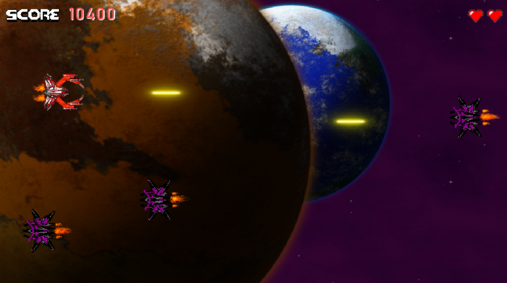

# SpaceShooter2D
 
A space shooter game [80s style]

## Game Files and Demo

- The gdscript code and the assets are all located in the equivalnent folders.
- A windows executable is located at Dark_Matter_Exe folder.

## Controls

Use arrow buttons to move and space to shoot. 

## Rules

**No rules.** Just shoot 'em all to survive

## Screenshots

### Level 1

### Level 1 Boss

### Level 2 Boss

### Level 3

## Copyright and License

- **[MIT license](https://opensource.org/licenses/MIT)**
- Copyright 2021 © <a href="https://github.com/NasosG" target="_blank">NasosG</a>.

## Copyright claims

**Thanks for reading**